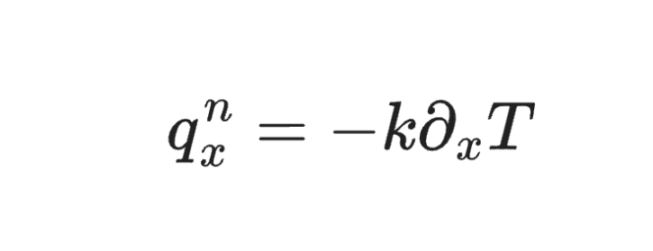

<br>
<div align='center'>
<h2>Dreams</h2>
<p> a beautiful lib, for getting educative video's 🍑</p>
<a href='https://pypi.org/project/dreams/'></a>
<a href='#'></a>
<a href='#'></a>

<br/>


</div>

<br>

<hr>

## pornone

```py
from dreams import pornone as pn


query = 'tony tigrao enrabando joyce oliveira'

url_list = pn.search_porn(query)

for url in url_list:
        print(url)

```
result
```sh
+18 content url's
```


